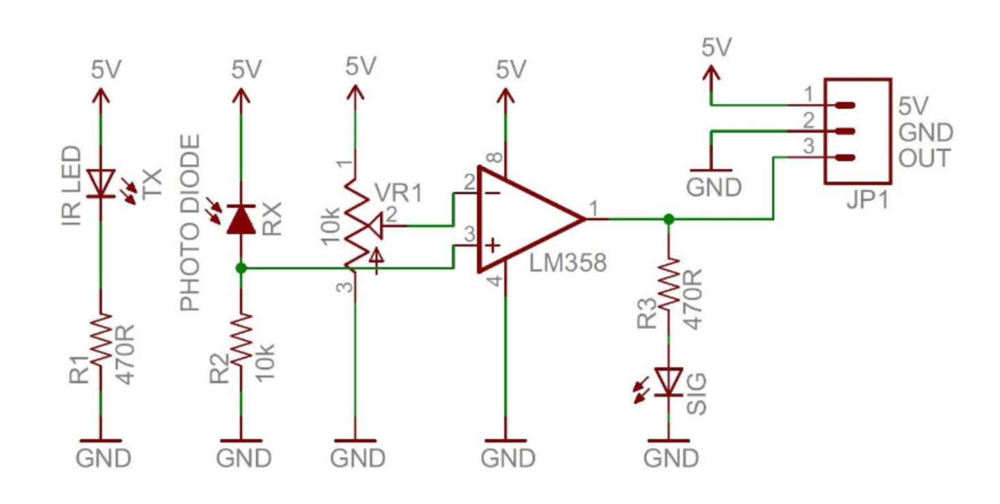

**ECE 49022 Senior Design Smart Candle**

Collaborators: Scottie Gilden, Jorge Hernandez, Andrew Kloosterman and Deimos Teng

Purpose: To build a device that can automate the lighting and extinguishing of a candle.

Resources:
- RP2350 Datasheet: https://pip-assets.raspberrypi.com/categories/1214-rp2350/documents/RP-008373-DS-2-rp2350-datasheet.pdf?disposition=inline#section_pwm
- RP2350 SDK Manual: https://pip-assets.raspberrypi.com/categories/609-microcontroller-boards/documents/RP-009085-KB-1-raspberry-pi-pico-c-sdk.pdf?disposition=inline
- Ultrasonic Ranging Module HC-SR04 Manual: https://cdn.sparkfun.com/datasheets/Sensors/Proximity/HCSR04.pdf
- A4988 Motor Driver Module Tutorial: https://lastminuteengineers.com/a4988-stepper-motor-driver-arduino-tutorial/
- 17HS16-2004S1 Stepper Motor Spec Sheet: https://www.omc-stepperonline.com/download/17HS16-2004S1.pdf
- IR Sensor Schematic:

  Provided by: https://components101.com/sites/default/files/component_datasheet/Datasheet%20of%20IR%20%20Sensor.pdf
