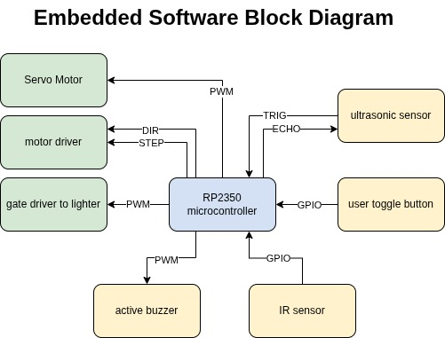
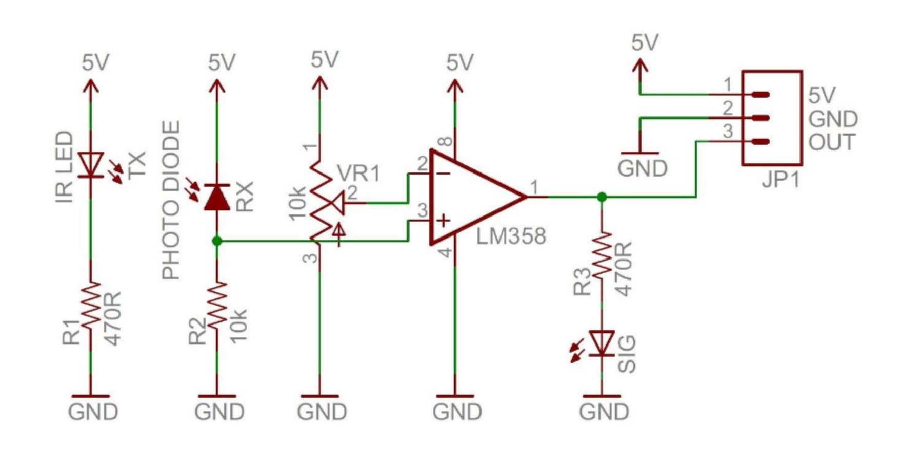

**ECE 49022 Senior Design Smart Candle**

Collaborators: Scottie Gilden, Jorge Hernandez, Andrew Kloosterman and Deimos Teng

Purpose: To build a device that can automate the lighting and extinguishing of a candle. 

Implementation: Ultrasonic sensor is used to read distance between mechanical fork and candle. IR sensor to determine whether or not candle is lit. Stepper motor for vertical movement and servo motor for horizontal movement. PWM drives the gate driver that toggles ignitor wire on and off. Timer set up to extinguish candle when unsafe conditions (candle lit for too long) arise.

Resources:
- RP2350 Datasheet: https://pip-assets.raspberrypi.com/categories/1214-rp2350/documents/RP-008373-DS-2-rp2350-datasheet.pdf?disposition=inline#section_pwm
- RP2350 SDK Manual: https://pip-assets.raspberrypi.com/categories/609-microcontroller-boards/documents/RP-009085-KB-1-raspberry-pi-pico-c-sdk.pdf?disposition=inline
- RP2350 Dev Board Pinout: https://ece362-purdue.github.io/proton-labs/assets/Proton%20Pinout%20Diagram.pdf
- Ultrasonic Ranging Module HC-SR04 Manual: https://cdn.sparkfun.com/datasheets/Sensors/Proximity/HCSR04.pdf
- A4988 Motor Driver Module Tutorial: https://lastminuteengineers.com/a4988-stepper-motor-driver-arduino-tutorial/
- 17HS16-2004S1 Stepper Motor Spec Sheet: https://www.omc-stepperonline.com/download/17HS16-2004S1.pdf
- TD-8120MG Servo Motor Spec Sheet: http://wiki.sunfounder.cc/images/9/9a/TD-8120MG_Digital_Servo.pdf
- IR Sensor Schematic:

  Provided by: https://components101.com/sites/default/files/component_datasheet/Datasheet%20of%20IR%20%20Sensor.pdf
